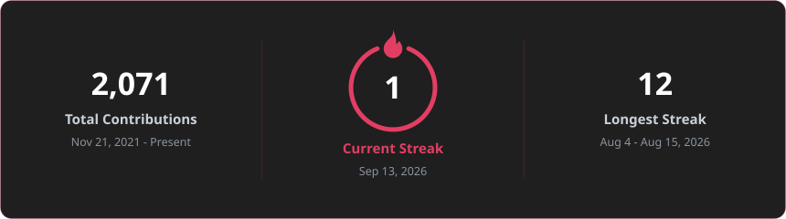
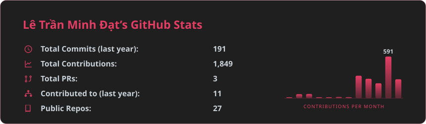

  <picture>
    <source media="(prefers-color-scheme: dark)" srcset="./assets/cicca-dark.png">
    
  </picture>

<h1 align="center">Lê Trần Minh Đạt </h1>

<b>Creative Developer & AI Engineer</b> — production AI agents · real-time systems · full-stack web

  
  
  
    
  

 

Full-stack & AI developer. I ship production AI agents (Claude Agent SDK, RAG/pgvector), real-time systems, and full-stack web apps — from AI trading platforms to VAS-compliant ERP.

Every LLM call I ship logs tokens, cost, latency and errors. A system you can't measure is a system you can't operate.

The mission log — what's shipped, what's still running — lives on **[portfolio.cicca.dpdns.org](https://portfolio.cicca.dpdns.org)**, kept current there rather than duplicated here.

 

## Stack

  

- **AI** — multi-provider LLM routing & fallback, hybrid RAG (pgvector + full-text), local ONNX embeddings, guardrails, YOLO / OpenCV / RTSP
- **Backend** — .NET 10, Node.js, WebSocket, event-driven, PostgreSQL + pgvector, Redis
- **Ops** — AWS, Docker Compose, GitHub Actions, systemd, on-prem / VPN deploys

 

  

